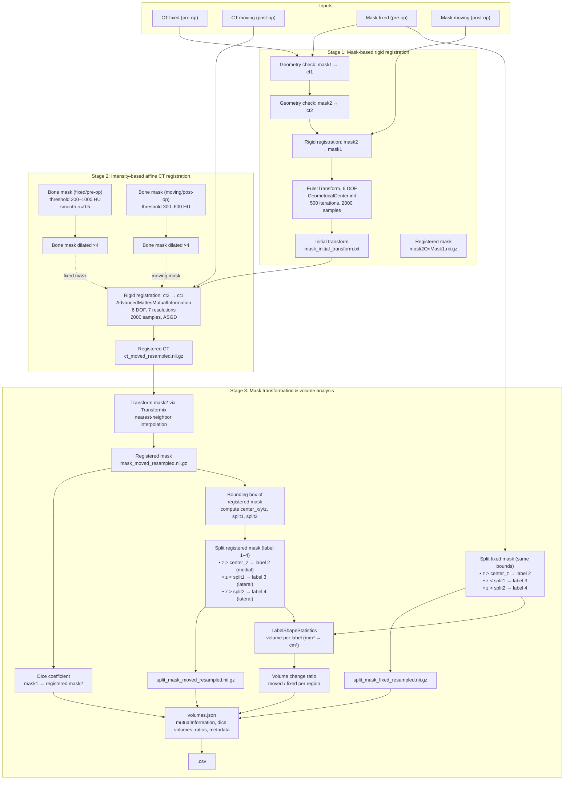

# CT orbit registration

Task: Register a post-operative CT to a pre-operative CT with their corresponding masks. Split the masks after registration and analyze left eye / right eye and lateral and medial changes.


Fig.: The above figure shows a visualization after data processing of a fused pre- and post-operative CT and masks after volume splitting. Regardless of soft-tissue changes visible between the two timepoints (6 years appart) bone-based registration is good. Medial region masks (green, yellow) in both eyes show an increase of volume (post-op). No apparent change in lateral masks. This is confirmed in the volume change ratios reported, medial (l/r): 1.72/1.76, lateral (l/r): 1.03/1.01.

**Data preparation**: All CT volumes are exported from research PACS (DICOM format). Masks for pre- and post-operative CT are expert drawn in PACS using a 2d area (polygon) tool. [pr2mask](https://github.com/mmiv-center/pr2mask) is used to convert polygon masks to binary masks in PACS (DICOM). Binary masks are exported from PACS into separate folders and used below for automated image registration and mask splitting into left eye / right eye and lateral / medial regions (3d).

Using SimpleITK and SimpleITK-SimpleElastix. All processing in this project uses pseudonymized DICOM files. The arguments of analyze.py point to the parent folder that contains them. In the following call nifti files are loaded instead (mostly untested).

```bash
conda activate nav_orbit_register_split
./analyze.py \
  -i1 data/NAV_ORBIT/images/1.3.6.1.4.1.45037.004171102544140049240402150654051107991535320.nii.gz \
  -i2 data/NAV_ORBIT/images/1.3.6.1.4.1.45037.417744054018056302213130162265012103225857091.nii.gz \
  -m1 data/NAV_ORBIT/labels/1.3.6.1.4.1.45037.004171102544140049240402150654051107991535320.nii.gz \
  -m2 data/NAV_ORBIT/labels/1.3.6.1.4.1.45037.417744054018056302213130162265012103225857091.nii.gz \
  --output /tmp/NAV_ORBIT_test/
cat /tmp/volumes.json
```

As output the following information is generated (/tmp/volumes.json).

```json
{
  "final_mutual_information": 1.24027,
  "full_masks_dice": 0.9029907246512155,
  "volume_change_ratio": {
    "Left eye / medial": 1.718,
    "Right eye / medial": 1.7642,
    "Left eye / lateral": 1.0277,
    "Right eye / lateral": 1.0083
  },
  "moved": {
    "Left eye / medial": 6.094768261645225,
    "Right eye / medial": 5.3841309189096425,
    "Left eye / lateral": 21.377972060092763,
    "Right eye / lateral": 20.881426106104357
  },
  "fixed": {
    "Left eye / medial": 3.547581782437404,
    "Right eye / medial": 3.0518850604551395,
    "Left eye / lateral": 20.8024475295336,
    "Right eye / lateral": 20.708862162457287
  },
  "fixed_image_name": "NAV-ORBIT_0XX",
  "moving_image_name": "NAV-ORBIT_0XX",
  "FixedSeriesInstanceUID": "1.2.752.2771",
  "MovingSeriesInstanceUID": "1.2.752.3771",
  "FixedSeriesDescription": "2",
  "MovingSeriesDescription": "1",
  "FixedEvent": "EventName:1",
  "MovingEvent": "EventName:2",
  "FixedStudyDate": "20180000",
  "MovingStudyDate": "20250000",
  "DayDifference": 2352
}
```

## Three-stage data processing pipeline

- **Intensity-based rigid registration** — bone mask extracted from pre-op CT (≥200 HU), dilated 4 voxels, used to constrain Elastix rigid transform (6 DOF: 3 translation + 3 rotation) registering post-op CT to pre-op CT space, transformation is initialized using a prior rigid post-op mask to pre-op mask registration
- **Mask transformation** — post-op mask re-sampled via nearest-neighbor interpolation using the computed transform
- **By eye mask splitting & volume analysis** — hierarchical split into 4 labeled regions. Stage 1: left eye / right eye based on position on mid lateral image, stage 2: split each eye into medial / lateral region based on estimated optic nerve location leaving the orbit mask. Volumes are computed in cm³.



The bone-masked based, rigid registration tolerates soft-tissue changes like weight-gain between pre- and post-operative CT time points.

I opted to move the post-operative CT towards the pre-operative CT. In some cases the pre-operative CT is of lower quality in our patient cohort which might introduce additional sources of failures to process.

Further sources of errors are streaking artifacts caused by metal implants in teeth. In some cases the operator has not sufficiently restricted the field of view to remove such artifacts either pre- or post-operative.

## Generated Files

| File |	What it is |
|------|-------------|
|ct_fixed.nii.gz	| Pre-op CT (reference) |
|ct_moved_resampled.nii.gz	| Post-op CT warped to pre-op space |
|mask_moved_resampled.nii.gz	| Post-op mask registered to pre-op space |
|split_mask_fixed_resampled.nii.gz	| Pre-op mask split into 4 regions |
|split_mask_moved_resampled.nii.gz	| Post-op mask split into 4 regions |
|volumes.json	| Volume per region, per image with QC measures |
|&lt;NAV_ORBIT_test&gt;.csv | Volume per region, per image with QC measures (csv format) |

## How to verify visually / numerically

- A larger mutual information value indicates a better fit. A value close to 0 would mean that both images are still misaligned. Here a value > 0.9 indicates an acceptable registration of post to pre-op CT.
- The dice coefficient between the aligned masks (before splitting) should be close to 1 for a good fit. A value of 1 indicates that both mask fit perfectly, which should not happen as both images are pre/post surgery. A value of 0 mean there is no overlap between the orbit masks after registration.
- The volume change ratios should be closer to 1 for the sides without surgery. Larger than one indicates that volume after surgery is larger by that factor compared to before surgery.
- Check that all four regions have non-zero volumes in both `fixed` and `moved` (unless the surgery intentionally removed tissue).
- Processing might have failed at an initial stage, check for a log file that indicates the reason for the failure, check the raw data using a tool like 3D Slicer or ITK Snap.
- Check that the total volume (sum of all four regions) is in a plausible range for orbital volumes (typically 25–45 cm³ total per eye in adults).
- **Failure indicators:**
  - A failure_log.md file is generated, no split masks available.
  - All volumes are 0 — the mask was empty or the splitting logic failed.
  - One region has an implausibly large volume (e.g., > 50 cm³) — the split may have assigned too many voxels to one region.
  - The `fixed` and `moved` volumes are identical — the registration transform may be the identity (no transformation applied).
